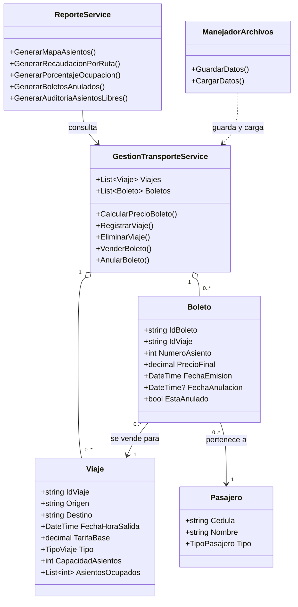

# Diagrama de clases: transporte

```mermaid
classDiagram
    class GestionTransporteService {
        +List~Viaje~ Viajes
        +List~Boleto~ Boletos
        +CalcularPrecioBoleto()
        +RegistrarViaje()
        +EliminarViaje()
        +VenderBoleto()
        +AnularBoleto()
    }
    class Viaje {
        +string IdViaje
        +string Origen
        +string Destino
        +DateTime FechaHoraSalida
        +decimal TarifaBase
        +TipoViaje Tipo
        +int CapacidadAsientos
        +List~int~ AsientosOcupados
    }
    class Boleto {
        +string IdBoleto
        +string IdViaje
        +int NumeroAsiento
        +decimal PrecioFinal
        +DateTime FechaEmision
        +DateTime? FechaAnulacion
        +bool EstaAnulado
    }
    class Pasajero {
        +string Cedula
        +string Nombre
        +TipoPasajero Tipo
    }
    class ReporteService {
        +GenerarMapaAsientos()
        +GenerarRecaudacionPorRuta()
        +GenerarPorcentajeOcupacion()
        +GenerarBoletosAnulados()
        +GenerarAuditoriaAsientosLibres()
    }
    class ManejadorArchivos {
        +GuardarDatos()
        +CargarDatos()
    }
    GestionTransporteService "1" o-- "0..*" Viaje
    GestionTransporteService "1" o-- "0..*" Boleto
    Boleto "0..*" --> "1" Pasajero : pertenece a
    Boleto "0..*" --> "1" Viaje : se vende para
    ReporteService --> GestionTransporteService : consulta
    ManejadorArchivos ..> GestionTransporteService : guarda y carga
```
